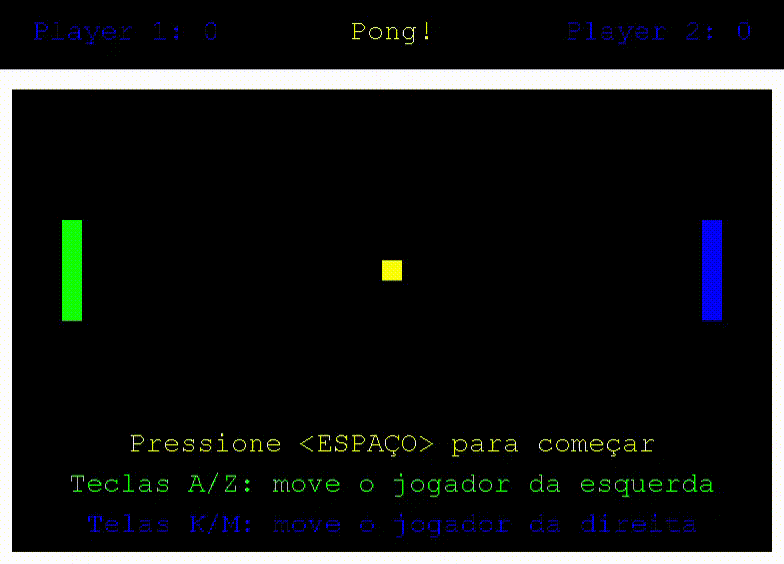

# Pong Game



## Instruções para execução:

**Necessário:**
- JDK 11

**Baixe o reposirório e certifique-se de ter na mesma pasta os seguintes arquivos:**

```bash
Ball.java
Player.java
Score.java
GameLib.class
MyFrame.class
MyKeyAdapter.class
Pong.class
Wall.class
```

**Em seguida é necessário estar no mesmo diretório dos arquivos mencionados acima e compilar “Ball.java, Player.java e Score.java” com o seguinte comando no terminal:**
```bash
javac Ball.java Player.java Score.java
```

**Após isso basta rodar o programa:**
```bash
java Pong
```
